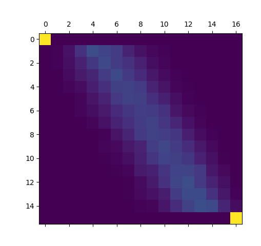
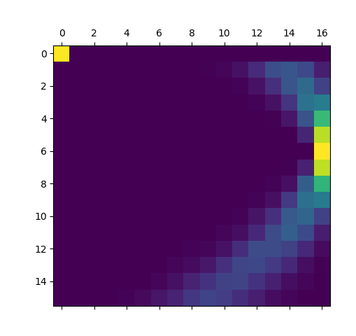

# Square or Not

Square or Not was the hardest crypto challenge of BreizhCTF 2024.

It implements a sort of encryption algorithm which seemed to involve quantum mechanics.
As all quantum objects, encrypted blocks could not be read but only destructively measured with a certain degree of 
randomness.

## Overview
A Python file and a server IP and port were given to us.

### Server overview

The file implemented a sort of server interface to which we could pass commands as JSON strings.

The main loop of the script used four variables:
- `list_current_message`
- `list_seen_message`
- `key`
- `index_key`

`key` is a random 16-bytes long byte array, `index_key` is zero at startup, `list_current_message` and `list_seen_message` are empty lists.

The possible commands could be sent, any other command would stop the script:
- inputMessage
- input_multiple_messages
- combine_message
- measure_message
- guess_key

inputMessage takes a single string as argument, which was checked to be a 32 characters long hex string which was then decoded as a 16-bytes long bytearray.
This data would be transformed into a `CipherBlock` object and added to the `list_current_message` array.

input_multiple_messages is a shorthand for many inputMessage calls.

Both calls store their input data into the `list_seen_message` and stop the script if they were already present.

combine_message enabled us to perform a sort of global xor in all current `CipherBlock` objects in `list_current_message`, leaving a single one, which is the result of the sum.
The function used for that is `xor_bloch_sphere` which is described below.

`measure_message` takes three fields, `INPUT`, `PHI` and `TETA`, calls the `measure` method on the first element of `list_current_message`, gives us the result and then clear `list_current_message`.

Finally, `guess_key` takes a single input byte and compares it to `key[index_key]`. The script fails if they are not equal, otherwise it increases `index_key` and clears `list_seen_message`. If they whole key is guessed, the flag is sent. 

The goal of this challenge then seems to be to somehow guess the key by creating, combining and measuring unique `CipherBlock` objects to leak the key.  

### Cipher blocks

A class named `CipherBlock` is used to represent a block of data of 16 bytes being encrypted.

An object of this class contained 16 sub-blocks as `BlochSphere`, created each with one the byte from the input with the 
function `int_to_bloch_sphere`. The key was passed to the constructor of the `CipherBlock` and each byte of it was 
stored as `BlochSphere` in the object.

`BlochSphere` objects contains two floating values, `phi` and `teta`. They are created by `int_to_bloch_sphere` by 
dividing the input bytes into two 4-bits values (nibbles) `a` and `b` and setting phi to `LIST_PHI[a]` and teta to 
`LIST_TETA[b]`.

Upon its creation in the mainloop, a `CipherBlock` undergo a few transformations through the 
function `prepare`, which can be inlined into the constructor.
These transformations only change the sub-block list, as they represent the block being encrypted.

Given how complex those transformations seemed, I decided at first to consider them as a black-box.

### A first rewrite

`BlochSphere` objects contains two floating numbers, but they are only used as floating numbers when their 
associated `CipherBlock` are being measured.

Every other references to these attributes is done by taking the index of the value in its associated list 
(`LIST_PHI` or `LIST_TETA`), updating the index and taking back the element at the new index, e.g.:

```python
self.phi = LIST_PHI[ ( LIST_PHI.index(self.get_phi())+number )%len(LIST_PHI) ]
```

The logic of the bloch spheres could therefore be simplified by rewriting the code to have teta and phi be their indices 
in the lists instead of their values. By doing so, threatening methods such as `pauli_x`, `pauli_z` which are used 
during the black-box phase and the measurement become way clearer:

```python
def pauli_x(self, number):
    self.teta = (self.teta + number) % 16
```

The `xor_bloch_sphere` function from the combine command and used during the processing of the block also becomes clearer: it 
simply xors phi and teta of two bloch spheres into a resulting one.

Note that after this rewrite is done and by consedring the encryption algorithm to be a black-box, `BlochSphere` 
behave exactly as pairs of integers between 0 and 16 and `CipherBlock` behave as a vector of them.

Below, all operation on `CipherBlock` and `BlochSphere` are meant to be understood as operations on vectors of pairs 
of integers lower than 16, i.e. vectors of integers.
These integer as referred below as the nibbles.

### Measurement

This code being an analogy to quantum mechanics, the values of the output cipher can only be measured in a 
destructive, non-deterministic way. The measure function implements this.

This function is called by the user with three arguments, index, index_phi_user, index_teta_user and perform the 
following:

- xor the index-th bloch sphere of the block with the BlochSphere (index_teta_user, index_phi_user)
- shuffle the blocks with a hardcoded permutation
- adds index to each teta and phi of its bloch spheres (i.e. add index to the whole vector)
- xor the key
- for each bloch sphere
  - measure 16 times its teta part
  - measure 16 times its phi part 

For a value teta (from the list), a measurement is done by picking a random number between -1 and 1 and checking if 
it is higher than `cos(teta)`. In this case, 1 is returned, 0 otherwise.
The same goes for phi.

The result of these measures is given in an integer, the 16 first bits being the result of the measures of teta, the
16 last being the measures of phi.

## Solution

By considering the whole algorithm to be black-box, we are slightly doomed as we cannot pass the same input more 
than once to remeasure the output with different measurement parameters and as the output is indistinguishable from 
randomness.

Let's solve those problems one by one.

### Input re-use

The challenge prevent us from passing the same input more than once, even by using the combine function as it is 
performed at the end of the encryption function (if it was performed one the input, we would just have to pick a 
pair of input and xor it to get whatever input we want and then reuse one).

A single code path allow us to flush the list of processed messages: the one taken when we predict correctly a byte 
from the key.

Assuming the solve algorithm to be fast enough, we can just plan on making a solution that will try a random first 
byte and execute the script as many time as needed to get it right.

The solution will therefore be divided in two phases, first sending vectors and reading their encrypted counterparts,
then guessing the first byte of the key and finally sending vectors again, maybe combine then and rereading their 
encrypted counterparts (and somehow leaking the key by doing that).
Note that we need to only leak one byte of the key as when it will be guessed, the list will get flushed again. 

This eliminates the first problem we have. Now, what could we pass to the server before and after this guess in order to leak the next byte of the key?

### Leaking the key by combination

Without the combination, the algorithm would be a black-box as long as we don't try to reverse the encryption process.
The combination function gives us a small "attack surface" after the end of the encryption process.

Passing index_teta_user=0 and index_phi_user=0 and index=i to the measure function, it does the following:

- (1) shuffle the block with a hardcoded permutation
- (2) adds index to each teta and phi of its bloch sphere
- (3) xor the key
- (4) measure all bloch spheres

The first step is a no-op with teta and phi being 0.

Let's call `a` and `b` two different `CipherBlock` after the shuffle step during measure.

When one of those `CipherBlock` is measured, all teta and phi of all its spheres get increased by i.
Let's note our new blocks `a+i` and `b+i`.
The key is then xored, let's note our blocks `(a+i)^key` and `(b+i)^key`, which are then measured.

When the two blocks combined are measured, this block is first `a^b`, becomes `(a^b)+i` and then `((a^b)+i)^key`, which 
is measured.

Admitting we can somehow lift the imprecision on the measure, if we can pass two input vectors during the first phase 
of our solution and then pass them back after the guess, combine them and read them again, we have the following data:
- `(a+i)^key`
- `(b+i)^key`
- `((a^b)+i)^key`

Doing the first measures with i=0, we have `a^key` and `b^key`, and we can compute `a^b`

Adding i and xoring with the last outcome, we get `((a^b)+i)^key ^ ((a^b)+i) = key`.

### Lifting the imprecision

The outline of a solution so far is to pass vectors, guess a byte and pass first vectors by pair, combining them in 
order to leak the key.

A first approach I considered to deal with the randomness problem was to use the fact that every nibble were 
independent during the measure function and to compute the likelihood of key taking one value or another given some 
measurements of `a^key`, `b^key` and `(a^b)^key`.

This method may have worked but is long to implement. A simpler version of it is to measure `a^key` and `(a+i)^key` 
and to compute some probabilities for the value of key.

As I did not have any better solution, I started implementing it by writing functions meant to map a measurement of 
a nibble with a probability vector of its value, i.e. making a function `f` so that `f(measure(x))[i]` is the 
likelihood that x is i, the function taking only the measure of x as argument.

Time running out, I implemented it (very) lazily by just measuring each value 1024 * 16 times and storing the amount 
of '0' in the measurement into a 2D-array, i.e. if `measure(x)` contains i zeros, `probs[x][i] += 1`.
The array is then normalized... which raises a `ZeroDivisionError`.

Plotting the array, we get the following for Teta measurements:




Except for teta=0 or teta=15, we can see the gaussian curves we expected in the lines of the graph.
For teta=0 or 15, the probability each 16 measurements to be and '1' is 0 or 1, therefore measurements are 
either 0x0000 for teta=0 and 0xffff for teta=15.

More importantly, the second column is the one causing the ZeroDvisionError: of all the measures done, not a single 
one ended up containing exactly one '1'. This implies a very low likelihood for a value being between 1 and 15 to have 
a measure containing only one '1' and an even lower likelihood of it having no '1'.

In other words, the value being '0' and the measurement being 0 is not only an implication, but an equivalence.
In the case of a teta nibble being zero, no randomness apply.

The same goes for teta=15 but the likelihood of a teta value not being 15 but having a '0xffff' measure is higher 
than for teta=0 due to the lack of a gap like the one in the first column.

The same principle applies for phi: 



A zero reading for a phi nibble implies that the nibble is zero.

## Packing the whole solution

The whole solution is therefore as follow:

For all nibbles, input many non-repeating vectors and measure their output until 32 input vectors whose output 
target nibble's value is zero are found.

Guess the first byte (and fail with a 255/256 probability).

Then, for all nibbles, input pair by pair the previously found vectors, combine them and read their output with index=i.
For any nibble, the output will be `((a^b)+i)^key`. `a` and `b` being zeros on this nibble, the result is 
`i^key`.
When the measurement is zero, `i = key` and a nibble from the key is recovered.

Giving the key back to the server, it replies with the flag : `BZHCTF{Bloc15ph3r31sinterest1nG}`

## Full code

```python
import json
import socket
import hashlib
from threading import Thread


def wait_for_measure(s):
    b = b""
    while b"The result of the measure is : " not in b:
        r = s.recv(4096)
        assert r
        b = b + r
    b = b.split(b"The result of the measure is : ")[-1]
    while b".\n" not in b:
        r = s.recv(4096)
        assert r
        b = b + r
    b = b.split(b".\n")[0]
    return [int(x) for x in b.decode().removeprefix("[").removesuffix("]").split(", ")]


def wait_for_guess(s):
    b = b""
    while (b"The byte is valid" not in b) and (b"Sorry, wrong key" not in b):
        r = s.recv(4096)
        assert r
        b = b + r
    return b"Sorry" not in b


def measure(s, p) -> list[int]:
    s.send(json.dumps({"TYPE": "inputMessage", "DATA": p.hex()}).encode() + b"\n")
    s.send(json.dumps({"TYPE": "measure_message", "INDEX": 0, "TETA": 0, "PHI": 0}).encode() + b"\n")
    return wait_for_measure(s)


def measure_phase2(s, p1, p2, index) -> list[int]:
    s.send(json.dumps({"TYPE": "input_multiple_messages", "MESSAGES": [p1.hex(), p2.hex()]}).encode() + b"\n")
    s.send(json.dumps({"TYPE": "combine_message"}).encode() + b"\n")
    s.send(json.dumps({"TYPE": "measure_message", "INDEX": index, "TETA": 0, "PHI": 0}).encode() + b"\n")
    return wait_for_measure(s)


def mlw():
    while True:
        s = socket.socket()
        s.connect(("challenge.ctf.bzh", 30011))
        # s.connect(("127.0.0.1", 12345))
        main_loop(s)
        s.shutdown(socket.SHUT_RDWR)
        s.close()


def main_loop(s=None):
    if s is None:
        s = socket.socket()
        # s.connect(("challenge.ctf.bzh", 30011))
        s.connect(("127.0.0.1", 12345))

    i = 0
    target_count = 16

    left_vectors = [[] for _ in range(16)]
    right_vectors = [[] for _ in range(16)]
    tvc = 0
    while tvc < 32 * 2 * (target_count - 1):
        i += 1
        cp1_src = hashlib.sha256(i.to_bytes(4, 'little')).digest()[:16]
        cp1_measure = measure(s, cp1_src)
        for j in range(1, target_count):
            if ((cp1_measure[j] >> 16) == 0) and (len(left_vectors[j]) < 32):
                tvc += 1
                left_vectors[j].append(cp1_src)
                break
            elif ((cp1_measure[j] & 0xffff) == 0) and (len(right_vectors[j]) < 32):
                tvc += 1
                right_vectors[j].append(cp1_src)
                break

    # r = randint(0, 255)
    r = 3
    s.send(json.dumps({"TYPE": "guess_key", "USERKEY": hex(r)[2:].zfill(2)}).encode() + b"\n")
    if not wait_for_guess(s):
        print("Bad early prediction :(")
        return False
    print("Good early prediction :D")

    left_values = []

    for index in range(1, target_count):
        for i in range(16):
            m = measure_phase2(s, left_vectors[index][i * 2], left_vectors[index][i * 2 + 1], i)
            if (m[index] >> 16) == 0:
                print("Found nibble:", i)
                left_values.append(i)
                break
        if len(left_values) != index:
            print("Late mispredict :(")
            return False

    right_values = []
    for index in range(1, target_count):
        for i in range(16):
            m = measure_phase2(s, right_vectors[index][i * 2], right_vectors[index][i * 2 + 1], i)
            if (m[index] & 0xffff) == 0:
                right_values.append(i)
                print("Found nibble:", i)
                break
        if len(right_values) != index:
            print("Late mispredict :(")
            return False
    print("Fully predicted :D")

    for x, y in zip(left_values, right_values):
        value = x * 16 + y
        s.send(json.dumps({"TYPE": "guess_key", "USERKEY": hex(value)[2:].zfill(2)}).encode() + b"\n")
    while True:
        r = s.recv(4096)
        if not r:
            break
        print(r)


def main():
    a = [Thread(target=mlw) for x in range(16)]
    for x in a:
        x.start()
    for x in a:
        x.join()


if __name__ == "__main__":
    main_loop()
```